# 分辨率 1080x1920+

| ID | 描述 | 热图  | 预览|
| --- | --- | --- | --- |
| splash-screen | 启动画面 | <ul><li>菜单按钮</li></ul> | 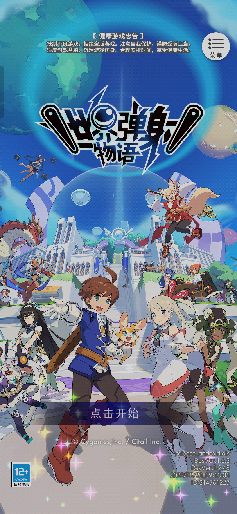 |
| scene-home | 游戏主页 | <ul><li>关卡</li><li>领主战</li><li>活动</li><li>任务</li><li>邮件</li></ul> | 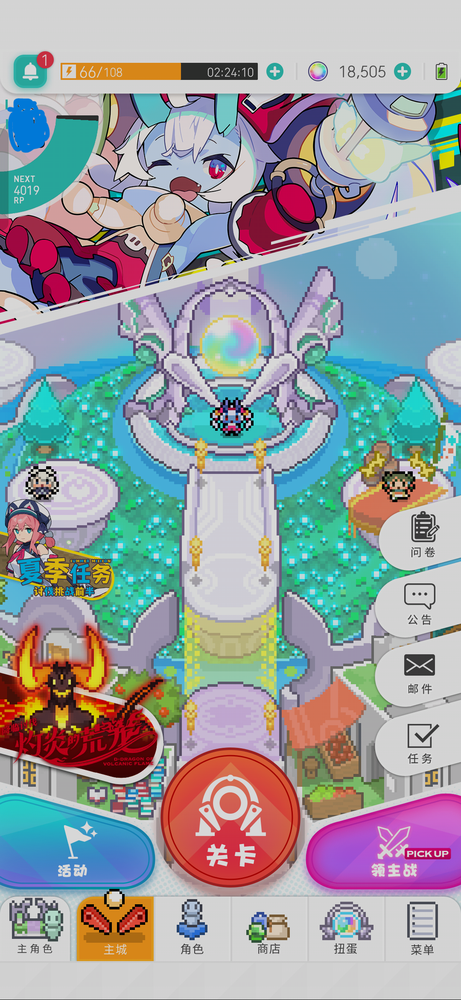 |
| ring-open | 打开铃铛列表 | <ul></ul> | 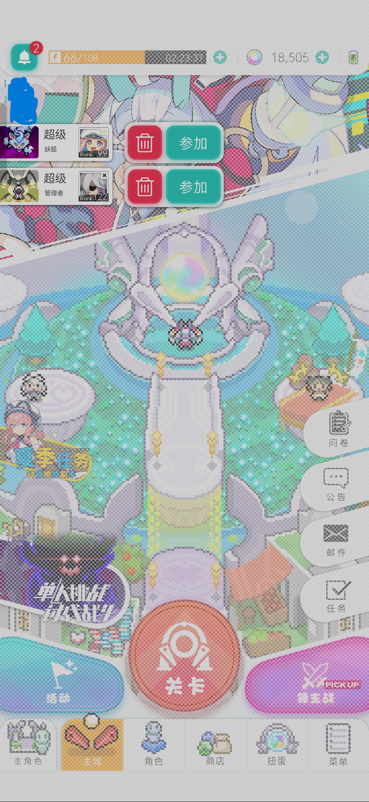 |
| ring | 主页发现铃铛 | <ul></ul> | 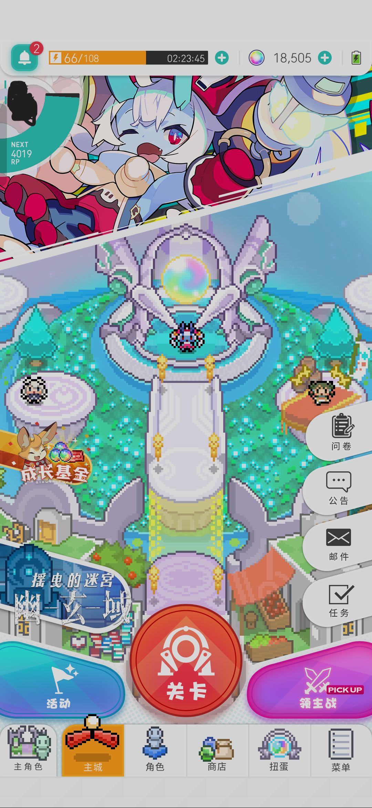 |
| scene-boss-levels | BOSS 关卡难度列表 | <ul></ul> | 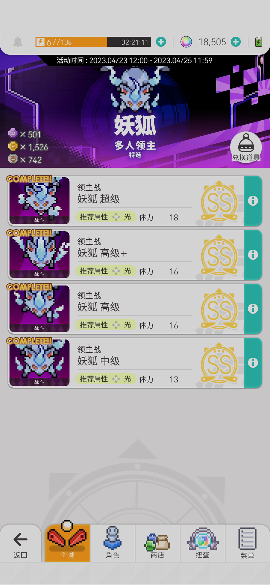 |
| scene-boss-players-bonus | BOSS 关卡多人战斗奖励提示 | <ul></ul> | 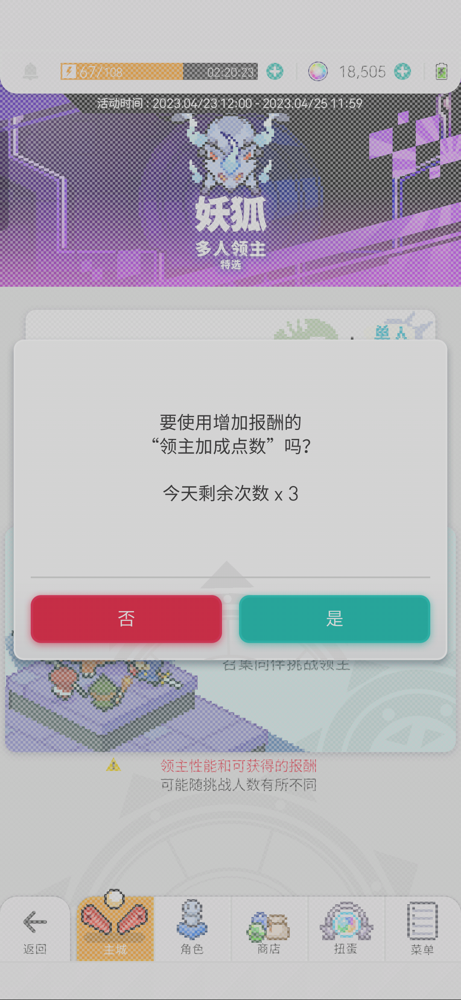 |
| scene-boss-players | 选择 BOSS 关卡是否进行多人战斗 | <ul></ul> | 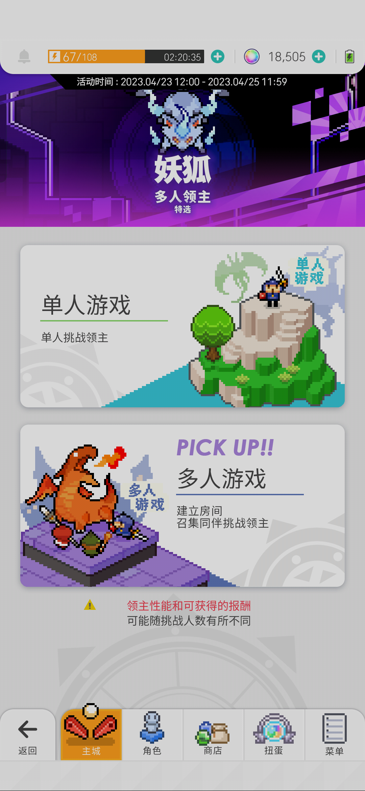 |
| scene-boss | BOSS 关卡列表 | <ul></ul> | 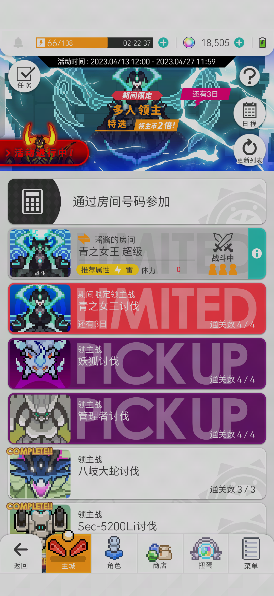 |
| scene-event | 活动列表 | <ul></ul> | 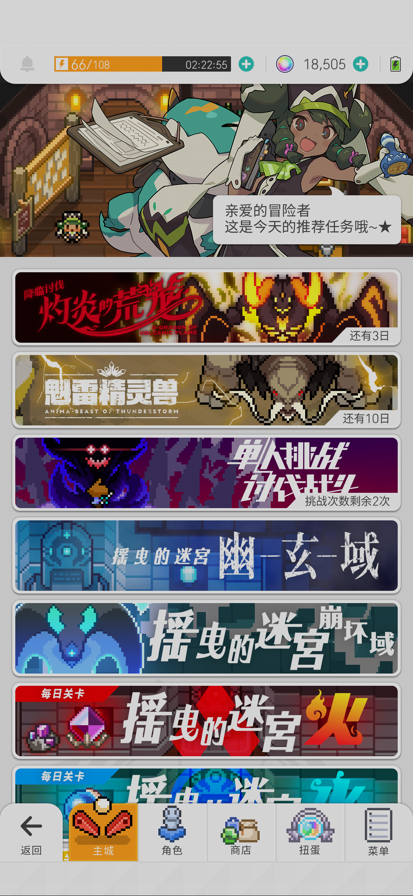 |
| scene-multiplayer-autos-disabled | 多人战斗等待界面续战和自动战斗按钮均关闭 | <ul></ul> | 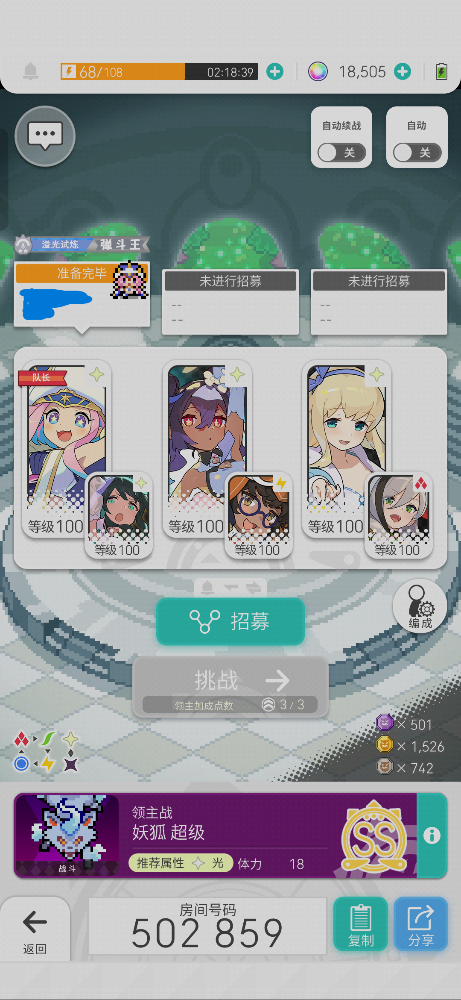 |
| scene-multiplayer-autos-enabled | 多人战斗等待界面续战和自动战斗按钮均开启 | <ul></ul> | 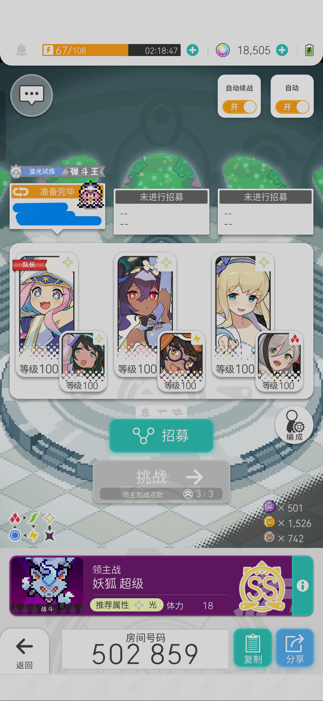 |
| scene-multiplayer-ready-with-bonus | 多人战斗（队长）准备完毕，附带奖励的开始按钮 | <ul></ul> | 暂无截图 |
| scene-multiplayer-ready | 多人战斗（队长）准备完毕，开始按钮 | <ul></ul> | 暂无截图 |
| scene-multiplayer-dissolve | 多人战斗房间解散 | <ul></ul> | 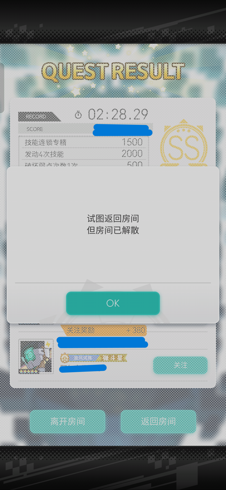 |
| scene-multiplayer-playing | 多人战斗进行中，自动技能开启 | <ul></ul> | 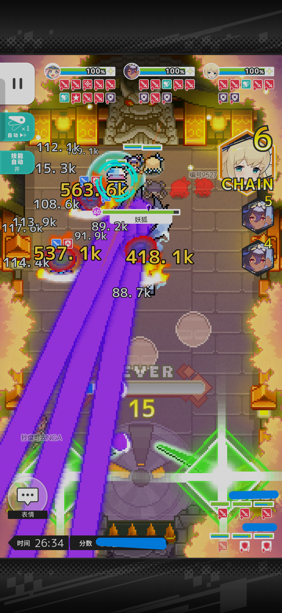 |
| scene-multiplayer-playing-autoskill-disabled | 多人战斗进行中，自动技能关闭 | <ul></ul> | 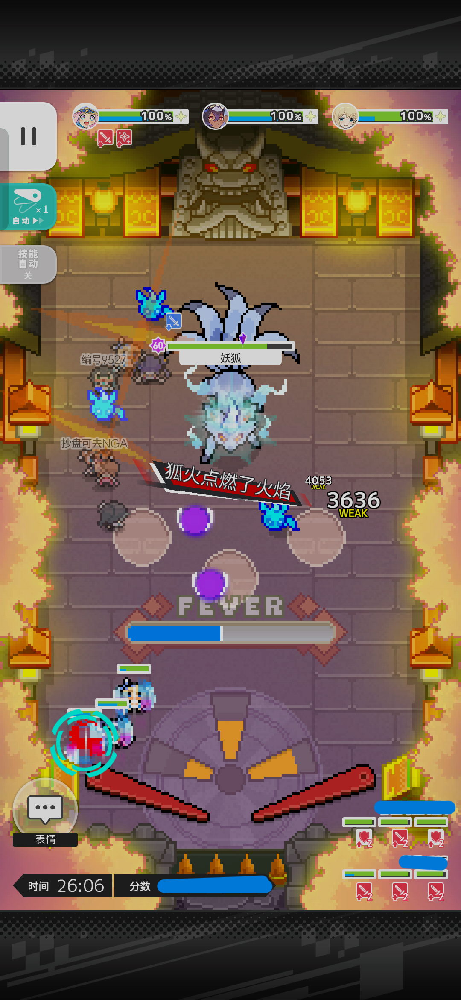 |
| scene-multiplayer-ready-no | 多人战斗（队员）未准备 | <ul></ul> | 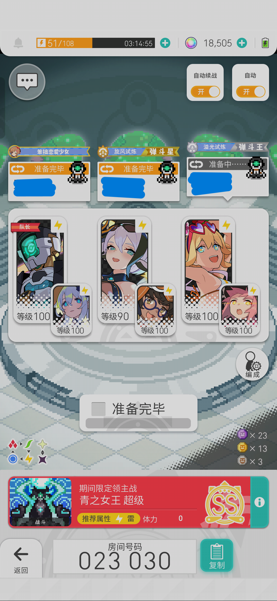 |
| scene-multiplayer-ready-yes | 多人战斗（队员）已准备 | <ul></ul> | 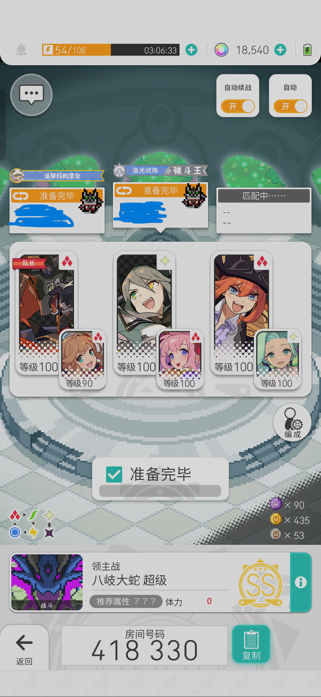 |
| scene-multiplayer-recruit-dialog-all-disabled | 多人战斗（队长）招募窗口，所有招募方式均关闭 | <ul></ul> | 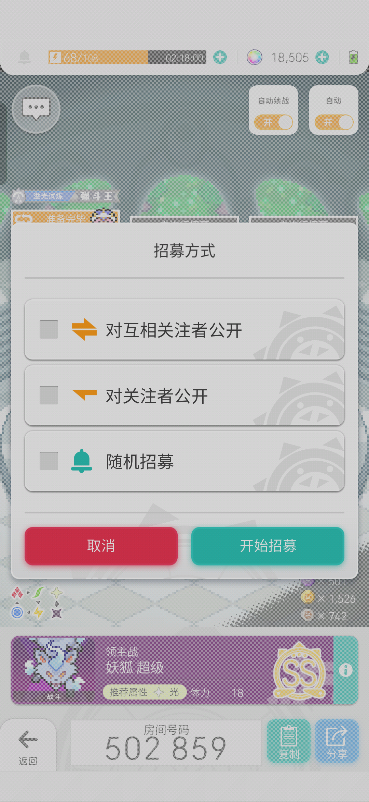 |
| scene-multiplayer-recruit-dialog-all-enabled | 多人战斗（队长）招募窗口，所有招募方式均开启 | <ul></ul> | 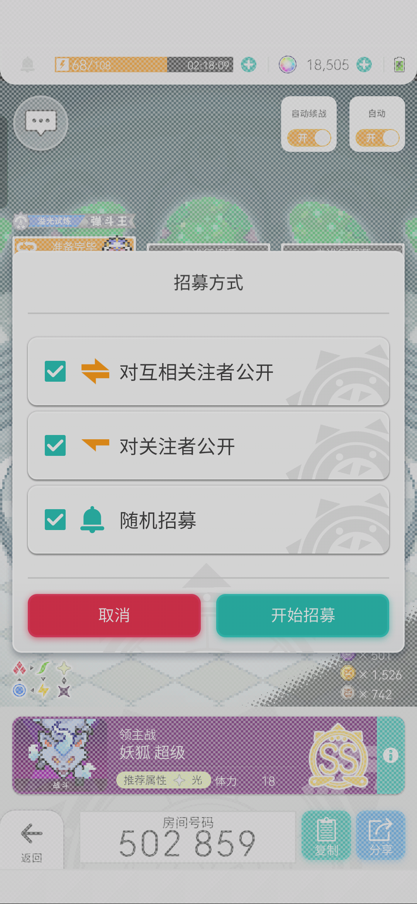 |
| scene-multiplayer-room | 多人战斗房间 | <ul></ul> | 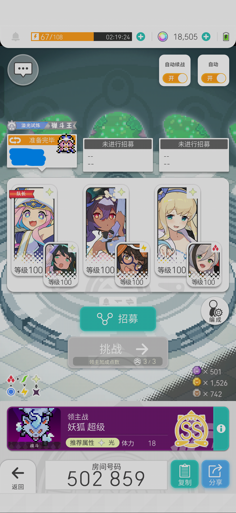 |
| scene-multiplayer-win | 多人战斗胜利结算（继续按钮） | <ul></ul> | 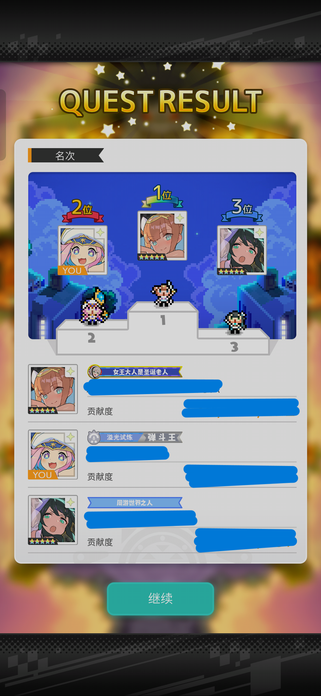 |